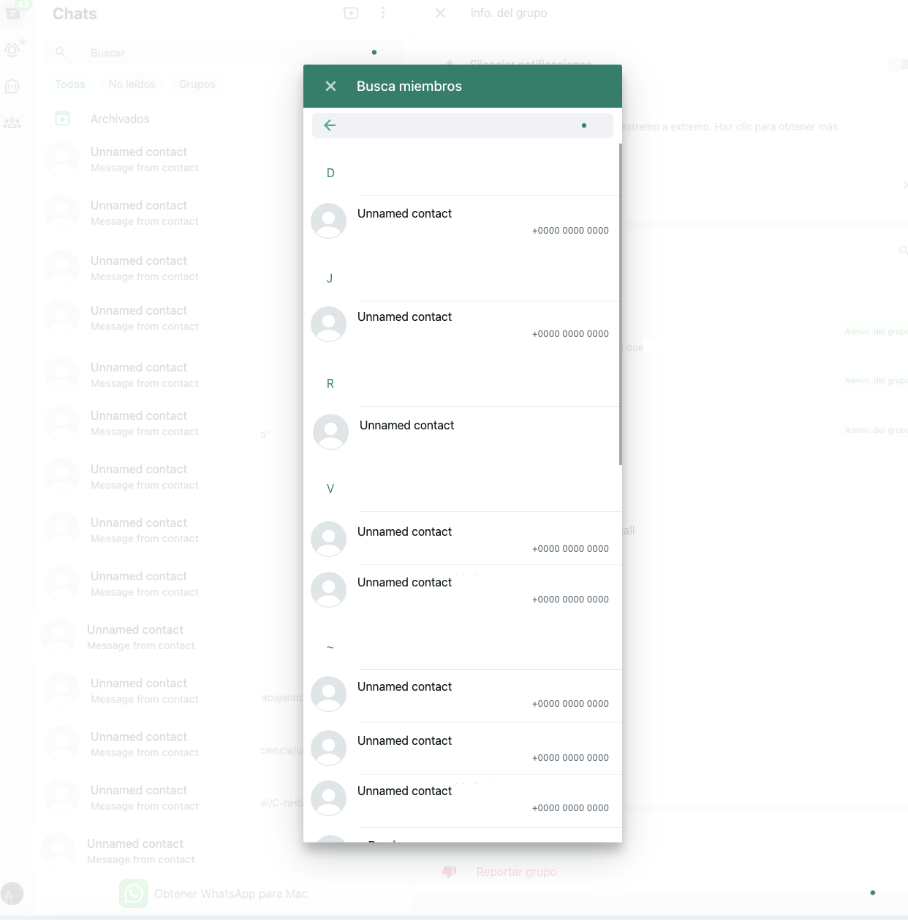

# WhatsApp Group Scraper

This repository contains a scraper to extract information about members of a WhatsApp group.

## Steps to Execute:

1. **Go to WhatsApp Web:**

   - Select the group from which you want to extract information.
   - Click on the group name to open the group details.
   - Scroll down to the "members" section.

2. **Display All Members:**

   - Fully expand the members list to ensure all participants are visible. It should look similar to the image below:

     

3. **Extract Member Information:**

   - Open your browser's developer tools (Inspect Element).
   - Navigate to the "Console" tab.
   - Paste the code from `extractor.js` into the console.
   - Press Enter to execute the script.

The script will extract and display information about all the group members.

---
